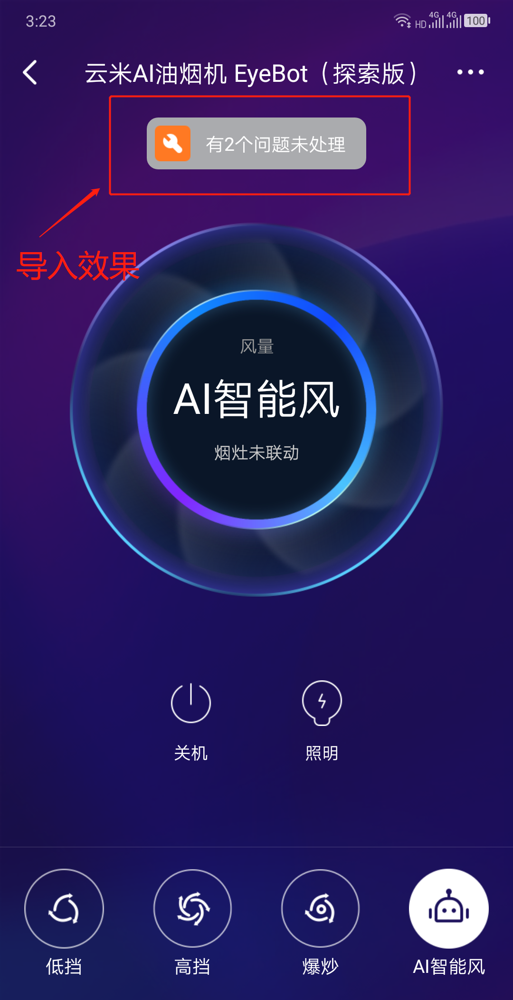
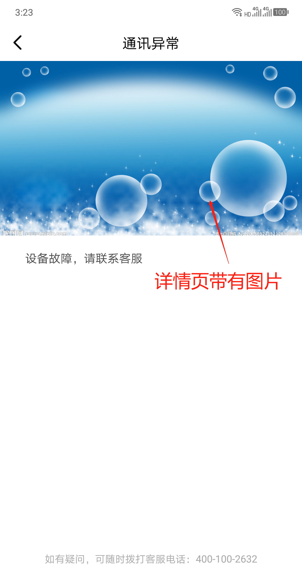

插件的通用页面主要包括以下

## 目录
- [故障通用页面](#故障通用页面)
  - [前言](#前言)
  - [属性说明](#属性说明)
  - [使用方法](#使用方法)
    - [方法一](#方法一)
    - [方法二](#方法二)
    - [其余属性使用说明](#其余属性使用说明)
- [设置页使用说明](#设置页使用说明)
   - [使用方法](#使用方法) 

  
##  故障通用页面

### 前言

为了统一云米插件的UI风格，提高插件接入效率，云米插件SDK提供一套标准的故障页面，如图。<br />

<center class="half">



</center>

  
###  属性说明
    
| 属性           | 类型                      | 默认值 | 是否必选                      | 描述                                                                                                                                                                                     |
|----------------|---------------------------|--------|-------------------------------|------------------------------------------------------------------------------------------------------------------------------------------------------------------------------------------|
| error          | Number<br>Array<br>String | null   | true<br>（和errorList二选一） | 故障代码，兼容三种故障数据类型，如下：<br>**7**（bit位故障码）<br>**[101, 102, 103]**<br>**"101,102,103"**（空调项目）                                                                   |
| errorList      | Array                     | null   | true<br>（和error二选一）     | 故障数组，数组中传入故障对象，每一个对象可包含3个属性：<br>**标题title**<br>**详情detail**（若无具体详情可不加该属性）<br>**详情图片pic**（以require方式导入，若无图片要求可不加该属性） |
| navigation     | Object                    | null   | true                          | 导航路由                                                                                                                                                                                 |
| errorTitle     | String                    | null   | false                         | MainPage页面的故障提示文本，若传入该值，则优先显示。<br>建议：若无特殊要求，不做修改                                                                                                     |
| containerStyle | Object                    | null   | false                         | 该组件在MainPage页面中的布局                                                                                                                                                             |
[⬆️回到目录](#目录)


  
###  使用方法
   
####  方法一
**说明：推荐使用。该方法使用多语言工具自动导入故障文本**

#####  导入文件
   
在Main文件夹下的index.js文件中添加
```
import MainPage from './MainPage';
import CommonPages from '../Viomi-plugin-sdk/CommonPages';
  
const RootStack = createStackNavigator(
  {
    MainPage,
    ...CommonPages,
  },
);
```
  
在Main文件夹下的MainPage.js文件中添加
```
import ErrorPromptBar from '../Viomi-plugin-sdk/CommonPages/ErrorPage/ErrorPromptBar';
```
  
**注意：由于传入的是故障码，为了能够自动引入多语言的故障标题和详情，对多语言文件中的故障命名有要求。**
  
在Lang文件夹下，单独创建放故障标题和详情的json文件，建议命名格式为：zhErrorJson.json、enErrorJson.json（其他语言同理）,如下：
```
├── Resources
│ ├── Lang
│ │ ├── en.json
│ │ ├── enErrorJson.json
│ │ ├── zh.json
│ │ ├── zhErrorJson.json
```

**注意：对于没有故障详情的情况，detail属性传入空字符串（""）。**
  
传入的error属性是int类型(bit位故障码的十进制)，强制命名要求如下：
error={7}
```
{
    "bit_0": {
        "title": "xxx",
        "detail": "xxx"
    },
    "bit_1": {
        "title": "xxx",
        "detail": "xxx"
    },
    "bit_2": {
        "title": "xxx",
        "detail": "xxx"
    }
    ...
}
```
  
传入的error属性是字符串、数组类型，强制命名要求如下：
error={[101, 102, 103]}
error={"101,102,103"}
```
{
    "error_101": {
        "title": "xxx",
        "detail": "xxx"
    },
    "error_102": {
        "title": "xxx",
        "detail": "xxx"
    },
    "error_103": {
        "title": "xxx",
        "detail": "xxx"
    }
    ...
}
```
  
在Main文件夹下的MainPage.js文件中添加
  
```
import I18nUnit from '../Viomi-plugin-sdk/Util/I18n/index';
import zhErrorJson from '../Resources/Lang/zhErrorJson.json';
import enErrorJson from '../Resources/Lang/enErrorJson.json';
  
//添加故障翻译文本
I18nUnit.addErrorDatas({
    zh: zhErrorJson,
    en: enErrorJson,
});
```
  
#####  在render的相应布局中添加使用
  
```
let error = 7;
let error = [101, 102, 103];
let error = "101,102,103";
  
<ErrorPromptBar
    error={error}
    navigation={this.props.navigation}>
</ErrorPromptBar>
```
[⬆️回到目录](#目录)
  
####  方法二

**说明：该方法主要是解决故障详情页带图片的情况，如图三。**
  
#####  导入文件
   
在Main文件夹下的index.js文件中添加
```
import MainPage from './MainPage';
import CommonPages from '../Viomi-plugin-sdk/CommonPages';
  
const RootStack = createStackNavigator(
  {
    MainPage,
    ...CommonPages,
  },
);
```
  
在Main文件夹下的MainPage.js文件中添加
```
import ErrorPromptBar from '../Viomi-plugin-sdk/CommonPages/ErrorPage/ErrorPromptBar';
```
 
#####  在render的相应布局中添加使用

**说明：errorList，故障对象数组按照之前的方式自行处理。** 
```
let errorList = 
[{title: "通讯异常", detail: "设备故障，请联系客服", pic: 111}, 
{title: "温度传感器异常", detail: "设备故障，请联系客服", pic: 222}];
  
<ErrorPromptBar
    errorList={errorList}
    navigation={this.props.navigation}>
</ErrorPromptBar>
```

[⬆️回到目录](#目录)

####  其余属性使用说明
    
```
let str = "这个有问题，查看一下";
  
<ErrorPromptBar
    errorTitle={str}
    containerStyle={styles.xxx}
    navigation={this.props.navigation}>
</ErrorPromptBar>
```
[⬆️回到目录](#目录)


## 设置页使用说明

> 功能设置可以自己定义

> 通用设置包括：使用帮助、设备重命名、设备升级、删除设备、位置管理、设备共享、法律信息、隐私设置、显示自动化、蓝牙、更多设置（网络信息、安全设置、反馈问题、添加桌面快捷方式）

## props

> 注意：当showMiLicense为true时，licenseUrl和privateUrl必须为有效URL
------------------
| 属性          | 默认参数 | 参数类型 | 说明                                |
|---------------|----------|----------|-------------------------------------|
| featureView   | null     | view     | 设置页面的自定义功能模块,默认为null |
| showUpdate    | true     | bool     | 是否显示固件更新                    |
| showAuto      | false    | bool     | 是否显示自动化（智能）              |
| showShare     | true     | bool     | 是否显示共享设备                    |
| licenseUrl    | null     | string   | 用户协议URL                         |
| privateUrl    | null     | string   | 隐私政策URL                         |
| isBluetooth   | false    | bool     | 是否是蓝牙设备                      |
| showMiLicense | false    | bool     | 米家是否显示使用条款和隐私政策      |

#### 导入文件

```js
// ~/Main/index.js
    import MainPage from './MainPage';
    import CommonPages from '../Viomi-plugin-sdk/CommonPages';

    const RootStack = createStackNavigator(
        {
            MainPage: MainPage,
            ...CommonPages,            
        }
    );

```
#### 使用

> 在Mainpage文件中的NavigationBar标签下的right使用（需要引入NavigationBar）

```js
// ~/Main/Mainpage.js
right={[{
        source: NavigationBar.ICON.MORE,
        onPress: () => {
            navigation.navigate('SettingPage', {
                featureView: <FeatureView navigation={navigation} />,
                showAuto: true,
                licenseUrl: '',
                privateUrl: '',
                showShare: true,
                showUpdate: true,
            });
        },
    }]}
```
#### 修改设备名称

> 修改成功，会发送一个事件：

```js
DeviceEventEmitter.emit(CommonAdapter.deviceNameChangedEvent(), {'newName':this.state.deviceName});
```
