## 目录

 - [按钮-Button](#按钮-button)

 - [消息弹窗-MessageDialog](#消息弹窗-messagedialog)

 - [滑动弹窗-SlideDialog](#滑动弹窗-slidedialog)

 - [滚动弹窗-WheelPickerDialog](#滚动弹窗-wheelpickerdialog)

 - [日期弹窗-DatePickerDialog](#日期弹窗-datepickerdialog)

 - [时间弹窗-TimePickerDialog](#时间弹窗-timepickerdialog)

 - [普通列表项-ListItem](#普通列表项-listitem)

 - [加载弹窗-Loading](#加载弹窗-loading)

 - [导航栏-NavigationBar](#导航栏-navigationbar)

 - [搜索框-SearchBar](#搜索框-searchbar)

 - [开关-Switch](#开关-switch)

 - [选项卡-Tab](#选项卡-tab)

 - [文本输入框-TextInput](#文本输入框-textinput)

 - [消息提示框-Toast](#消息提示框-toast)

## 按钮-Button

#### 引入

``` js
import {
    IconTextButton
} from '../Components/Button';
```

#### 例子

``` js
< IconTextButton
text = '按钮标题'
subText =  '副标题'
value = {false}
onPress = {
    () => {console.log('IconTextButton')}
}
unselectedTintColor = {'#8E9DB0'}
selectedColor = {'#02CFBE'}
iconSource = {
    require('图片地址')
}
containerStyle =  {{
        marginLeft: 10,
        marginRight: 10
    }}
/>
```

#### props

| 属性                  | 默认参数  | 参数类型                      | 是否必选 | 说明                                                 |
|-----------------------|-----------|-------------------------------|----------|------------------------------------------------------|
| onPress               | undefined | function                      | true     | 点击回调                                             |
| size                  | lg        | xxl、xl、lg(默认)、md、sm、xs | false    | 按钮尺寸                                             |
| text                  | undefined | string                        | false    | 标题                                                 |
| subText               | undefined | string                        | false    | 副标题                                               |
| icon                  | null      | ico                           | false    | 直接导入图标                                         |
| iconSource            | undefined | img                           | false    | 图片资源                                             |
| containerStyle        | undefined | style                         | false    | 容器样式                                             |
| iconStyle             | undefined | style                         | false    | 图标样式                                             |
| titleStyle            | undefined | style                         | false    | 标题样式                                             |
| subTitleStyle         | undefined | style                         | false    | 副标题样式                                           |
| selectedColor         | '#28beca' | string                        | false    | 选中时的主色（背景颜色）                             |
| unselectedColor       | '#ffffff' | string                        | false    | 未选中时的主色（背景颜色）                           |
| selectedTintColor     | '#ffffff' | string                        | false    | 选中时的tint颜色（文字和图片）                       |
| unselectedTintColor   | '#4c4c4c' | string                        | false    | 未选中时的tint颜色（文字和图片）                     |
| selectedBorderColor   | undefined | string                        | false    | 选中时的边框颜色（默认无边框，设定颜色则存在边框）   |
| unselectedBorderColor | undefined | string                        | false    | 未选中时的边框颜色（默认无边框，设定颜色则存在边框） |
| borderRadiusSize      | undefined | number                        | false    | 边框样式：默认左右半圆，设置数字则按照数字           |
| selected              | false     | bool                          | false    | 是否选中                                             |
| disabled              | false     | bool                          | false    | 是否禁止使用                                         |
| isLoading             | false     | bool                          | false    | 是否正在加载中                                       |
                      

[⬆️回到目录](#目录)

***    

## 消息弹窗-MessageDialog

### 预览

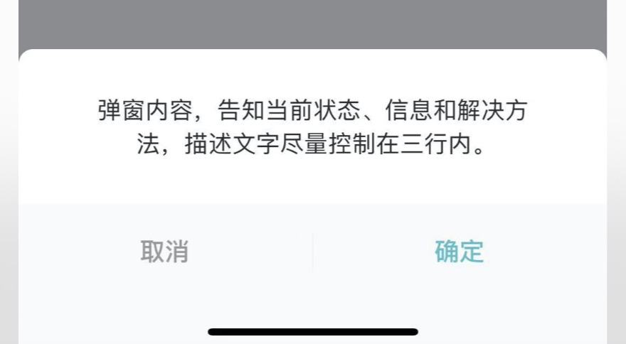
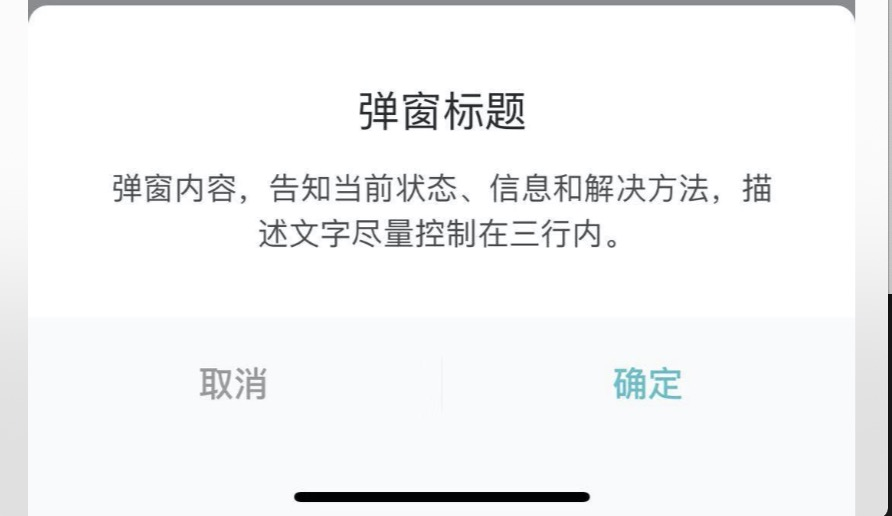
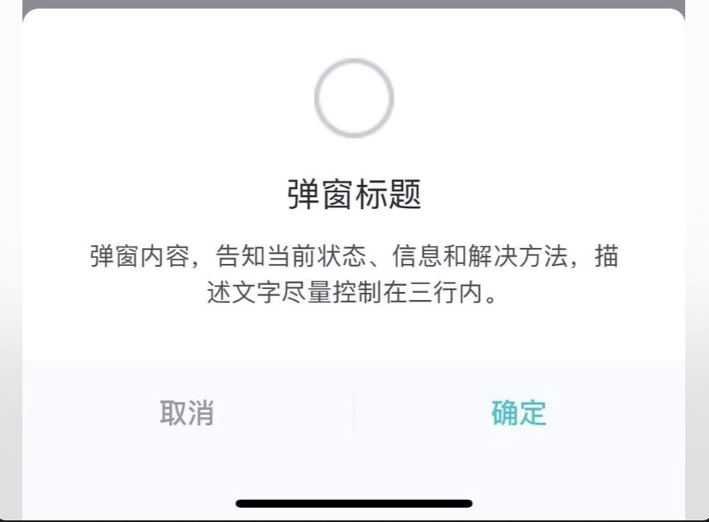
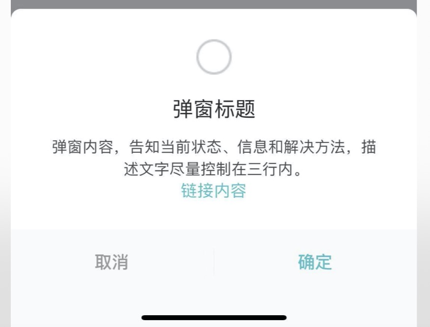

### 基本信息

| 基本信息 |                                      |
|----------|--------------------------------------|
| 中文名称 | 云米插件消息通用弹窗                 |
| 描述     | 可自定义弹窗内容，顶部icon，链接     |
| 位置     | `components/Dialog/MessageDialog.js` |
| 注意事项 | \                                    |

### 使用方法

``` jsx

<IconTextButton
    title='开启弹窗'
    onPress={()=>{
        this.refs.dialog.show()
    }}
/>
<MessageDialog
    title="MessageDialog"
    message="我是提示文字"
    icon={require('图片路径')}
    iconSize={26}
    link="链接"
    onLinkPress={v => { alert('你点击了链接') }}
    ref="dialog"
    onPress={(...v) => { console.log('onpress', v); this.refs.dialog.hide() }}
    onShow={(...v) => { console.log('onShow', v) }}
    onDismiss={(...v) => { console.log('onDismiss', v) }}
    onAndroidRequestClose={(...v) => { console.log('onAndroidRequestClose', v); this.refs.dialog.hide() }}
    >
</MessageDialog>
```
### props

| 属性                  | 默认参数                 | 参数类型 | 是否必选 | 说明                             |
|-----------------------|--------------------------|----------|----------|----------------------------------|
| onShow                | ()=>{}                   | function | true     | Modal显示时的回调函数            |
| onDismiss             | ()=>{}                   | function | true     | Modal隐藏时的回调函数            |
| onPress               | ()=>{}                   | function | true     | 点击事件回调函数                 |
| title                 | null                     | string   | false    | 消息弹窗标题                     |
| message               | null                     | string   | false    | 显示消息弹窗内容                 |
| icon                  | null                     | string   | false    | 图标链接                         |
| iconSize              | 36(1080P),icon存在时生效 | number   | false    | 图标尺寸                         |
| link                  | null                     | string   | false    | 链接内容                         |
| onLinkPress           | ()=>{}                   | function | false    | 点击链接回调函数                 |
| onAndroidRequestClose | ()=>{}                   | function | false    | Android 按下返回物理键的回调函数 |

[⬆️回到目录](#目录)

***

## 滑动弹窗-SliderDialog
### 预览

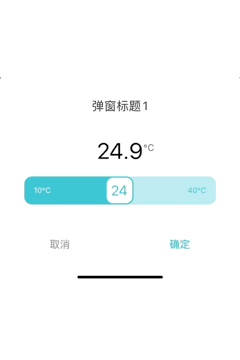

### 使用方法

```jsx
 <SliderDialog
    ref="dialog"
    title="弹窗标题1"
    unit="℃"
    defaultValue={26}
    minValue={10}
    maxValue={40}
    showValue={false}
    onPress={(index, value) => { alert(index + " " + value) }}
    ></SliderDialog>
```

#### SliderDialog props

| 属性         | 默认参数 | 参数类型 | 是否必选 | 说明                          |
|--------------|----------|----------|----------|-------------------------------|
| onPress      | ()=>{}   | func     | true     | 点击回调                      |
| maxValue     | null     | number   | true     | slide范围最大值               |
| minValue     | null     | number   | true     | slide范围最小值               |
| title        | null     | string   | false    | 标题文本                      |
| unit         | null     | string   | false    | 单位                          |
| defaultValue | null     | number   | false    | 默认值                        |
| showValue    | false    | bool     | false    | 是否在slide滑块button内显示值 |
[⬆️回到目录](#目录)

***    
## 滚动弹窗-WheelPickerDialog
### 预览

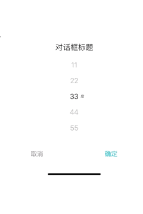

### 使用方法

```jsx
  <WheelPickerDialog
    data={[{
        key: '1',
        value: '11'
    }, {
        key: '2',
        value: '22'
    }, {
        key: '3',
        value: '33'
    }, {
        key: '4',
        value: '44'
    }, {
        key: '5',
        value: '55'
    }]}
    defaultSelected="3"
    title="对话框标题"
    ref="dialog5"
    onPress={(index, value) => { alert(index + " " + value) }}
    unit="度"
                />
```

#### WheelPickerDialog props

| 属性            | 默认参数 | 参数类型 | 是否必选 | 说明           |
|-----------------|----------|----------|----------|----------------|
| data            | null     | array    | true     | 滚动对应键值对 |
| onPress         | ()=>{}   | func     | true     | 点击回调       |
| title           | null     | string   | false    | 标题文本       |
| defaultSelected | null     | string   | false    | 默认选中值     |
| unit            | null     | string   | false    | 单位           |

[⬆️回到目录](#目录)

***    
## 日期弹窗-DatePickerDialog
### 预览

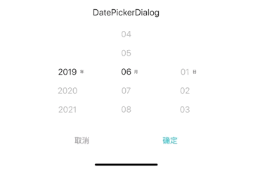

### 使用方法

```jsx
    <IconTextButton
        title='开启弹窗'
        onPress={()=>{
            this.refs.dialog6.show('2019/3/3', '2022/9/9', '2019/6/1')
        }}
    />

   <DatePickerDialog
        title="DatePickerDialog"
        ref="dialog6"
        onPress={(index, value) => { alert(index + " " + value) }}
        />
```

#### DatePickerDialog props

| 属性                               | 默认参数 | 参数类型 | 是否必选 | 说明                         |
|------------------------------------|----------|----------|----------|------------------------------|
| onPress                            | ()=>{}   | func     | true     | 点击回调                     |
| title                              | null     | string   | false    | 标题文本                     |
| show(beginTime, endTime, initTime) | null     | function | false    | 开始时间，结束时间，当前时间 |

[⬆️回到目录](#目录)

***    
## 时间弹窗-TimePickerDialog
### 预览

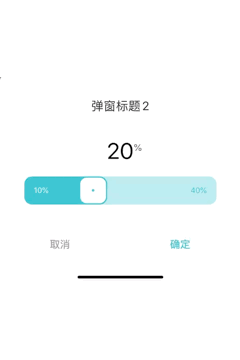

### 使用方法

```jsx
    <IconTextButton
        title='开启弹窗'
        onPress={()=>{
            this.refs.dialog7.show('00:00:00', '23:59:59', '00:01:50')
        }}
    />
   <TimePickerDialog
        type="mmss"
        title="TimePickerDialog"
        ref="dialog7"
        onPress={(index, value) => { alert(index + " " + value) }} // 点击底部按钮回调函数，设置的副作用：阻止隐藏
        />
```

#### TYPE(时间选择器类型)

| Name   | Type   | Value              | beginTime  | endTime    | Description |
|--------|--------|--------------------|------------|------------|-------------|
| HH     | string | &quot;hh&quot;     | '00:00:00' | '23:00:00' | 小时        |
| MM     | string | &quot;mm&quot;     | '00:00:00' | '00:59:00' | 分钟        |
| SS     | string | &quot;ss&quot;     | '00:00:00' | '00:00:59' | 秒          |
| HHMM   | string | &quot;hhmm&quot;   | '00:00:00' | '23:59:00' | 时分        |
| MMSS   | string | &quot;mmss&quot;   | '00:00:00' | '00:59:59' | 分秒        |
| HHMMSS | string | &quot;hhmmss&quot; | '00:00:00' | '23:59:59' | 时分秒      |

#### TimePickerDialog props

| 属性    | 默认参数 | 参数类型 | 是否必选 | 说明           |
|---------|----------|----------|----------|----------------|
| onPress | ()=>{}   | func     | true     | 点击回调       |
| title   | null     | string   | false    | 标题文本       |
| type    | null     | TYPE     | false    | 时间选择器类型 |
| show(beginTime, endTime, initTime) | null | function | false | 开始时间，结束时间，当前时间 |

[⬆️回到目录](#目录)

***    

## 基础图片-BaseImage

### 引入

```js
import {BaseImage} from "../Viomi-plugin-sdk/Components/Image";

```

### 例子

```js
<BaseImage size={100}/>

```

### BaseImage props
| 属性  | 默认参数 | 参数类型 | 是否必选 | 说明             |       
|-------|----------|---------|----------|------------------|
| size | null      | number  | false    | 图片大小          |

[⬆️回到目录](#目录)

***

## 普通列表项-ListItem

> ListItem 基本用在功能设置与通用设置

#### 引入

``` js
import {
    ListItem,
    ListItemWithTopItem,
    ListItemWithSwitch,
    ListItemWithButton
} from '../Viomi-plugin-sdk/ListItem';
```

#### 例子

``` js
< ListItem
    title={
        '标题'
    }
    value={
        '右侧文案'
    }
    subtitle={
        '左侧副标题'
    }
    disabled={
        false
    }
    showSeparator={
        true
    }
    hideArrow={
        false
    }
    hasRedPoint={
        false
    }
    titleStyle={
        { color: '#030303' }
    }
    subtitleStyle={
        { color: '#3c3c3c' }
    }
    valueStyle={
        { color: '#00ff00' }
    }
    redPointStyle={
        { backgroundColor: '#ff0000' }
    }
    onPress={
        () => {
            console.log('ListItem')
        }
    }
/>
<ListItemWithTopItem
    title={
        '标题'
    }
    topTitle={
        '顶部标题'
    }
    titleStyle={
        { color: '#030303' }
    }
    topTitleStyle={
        { color: '#3c3c3c' }
    }
    containerStyle={
        { backgroundColor: '#ffffff' }
    }
    topImageSource={
        require('./image/coarse_cereal_porridge_icon.png')
    }
    onPress={
        () => {
            console.log('ListItemWithTopItem')
        }
    }
/>
<ListItemWithSwitch
    title={
        '标题'
    }
    subtitle={
        '副标题'
    }
    value={
        false
    }
    disabled={
        false
    }
    showSeparator={
        true
    }
    titleStyle={
        { color: '#030303' }
    }
    subtitleStyle={
        { color: '#3c3c3c' }
    }
    onColor='#28beca'
    offColor="white"
    offBorderColor='#3c3c3c'
    containerStyle={
        { backgroundColor: '#ffffff' }
    }
    onValueChange={
        () => {
            console.log('ListItemWithSwitch')
        }
    }
/>
<ListItemWithButton
    title={
        '标题'
    }
    subtitle={
        '副标题'
    }
    buttonTitle={
        '按钮'
    }
    disabled={
        false
    }
    showSeparator={
        true
    }
    titleStyle={
        { color: '#030303' }
    }
    subtitleStyle={
        { color: '#3c3c3c' }
    }
    containerStyle={
        { backgroundColor: '#ffffff' }
    }
    onPress={
        () => {
            console.log('ListItemWithButton')
        }
    }
/>
```

#### ListItem-props

| 属性           | 默认参数 | 参数类型 | 是否必选 | 说明                 |
|----------------|----------|----------|----------|----------------------|
| title          | '标题'   | string   | true     | 标题文本             |
| onPress        | null     | func     | true     | 点击回调             |
| subtitle       | null     | string   | false    | 左侧副标题           |
| value          | ' '      | string   | false    | 右侧文案             |
| disabled       | false    | bool     | false    | 是否禁用点击         |
| showSeparator  | true     | bool     | false    | 是否显示分割线       |
| hideArrow      | false    | bool     | false    | 是否隐藏右侧箭头图片 |
| hasRedPoint    | false    | bool     | false    | 是否有小红点         |
| containerStyle | null     | style    | false    | 容器样式             |
| titleStyle     | null     | style    | false    | 标题文本样式         |
| subtitleStyle  | null     | style    | false    | 副标题的自定义样式   |
| valueStyle     | null     | style    | false    | 右侧文案的自定义样式 |
| redPointStyle  | null     | style    | false    | 小红点样式           |

#### ListItemWithTopItem-props

| 属性           | 默认参数 | 参数类型 | 是否必选 | 说明                 |
|----------------|----------|----------|----------|----------------------|
| title          | '标题'   | string   | true     | 标题文本             |
| onPress        | null     | func     | true     | 点击回调             |
| topTitle       | null     | string   | false    | 顶部标题             |
| topImageSource | null     | url      | false    | 顶部图片资源         |
| containerStyle | null     | style    | false    | 容器样式             |
| titleStyle     | null     | style    | false    | 标题文本样式         |
| topTitleStyle  | null     | style    | false    | 顶部标题的自定义样式 |

#### ListItemWithSwitch-props

| 属性           | 默认参数             | 参数类型 | 是否必选 | 说明                 |
|----------------|----------------------|----------|----------|----------------------|
| title          | '标题'               | string   | true     | 标题文本             |
| onValueChange  | ()=>{}               | func     | true     | 点击回调             |
| value          | false                | bool     | true     | 右侧按钮开关         |
| subtitle       | null                 | string   | false    | 副标题               |
| disabled       | false                | bool     | false    | 是否禁用点击         |
| showSeparator  | true                 | bool     | false    | 是否显示分割线       |
| containerStyle | null                 | style    | false    | 容器样式             |
| titleStyle     | null                 | style    | false    | 标题文本样式         |
| topTitleStyle  | null                 | style    | false    | 顶部标题的自定义样式 |
| onColor        | '#28beca'            | string   | false    | 开关打开颜色         |
| offColor       | 'white'              | string   | false    | 开关关闭颜色         |
| offBorderColor | 'rgba(0, 0, 0, 0.1)' | string   | false    | 开关关闭边框颜色     |

#### ListItemWithButton-props

| 属性           | 默认参数 | 参数类型 | 是否必选 | 说明               |
|----------------|----------|----------|----------|--------------------|
| title          | '标题'   | string   | true     | 标题文本           |
| buttonTitle    | '按钮'   | string   | true     | 右侧按钮开关       |
| onPress        | ()=>{}   | func     | true     | 点击回调           |
| subtitle       | null     | string   | false    | 副标题             |
| disabled       | false    | bool     | false    | 是否禁用点击       |
| showSeparator  | true     | bool     | false    | 是否显示分割线     |
| containerStyle | null     | style    | false    | 容器样式           |
| titleStyle     | null     | style    | false    | 标题文本样式       |
| subtitleStyle  | null     | style    | false    | 副标题的自定义样式 |

[⬆️回到目录](#目录)

***    
## 加载弹窗-Loading


### 预览

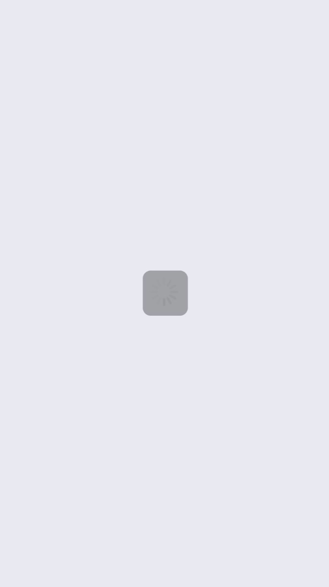

### 使用方法

```jsx
import LoadingEffect from '../../../Viomi-plugin-sdk/Components/Loading/Loading'

  <View style={{ flex: 1 }}>
        <LoadingEffect visible={isVisible}></LoadingEffect>
    </View>
```

#### laoding props

| 属性    | 默认参数 | 参数类型 | 是否必选 | 说明            |
|---------|----------|----------|----------|-----------------|
| visible | false    | false    | false    | 是否显示loading |

[⬆️回到目录](#目录)

***    
## 导航栏-NavigationBar
### 预览

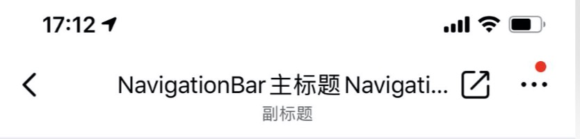

### 使用方法

```jsx
import { NavigationBar } from '../../../Viomi-plugin-sdk/Components/NavigationBar';

 static navigationOptions = ({ navigation }) => {
        let featureView = <View style={{}} >
        </View>
        return {
            header: <NavigationBar
                type={NavigationBar.TYPE.LIGHT}
                navigation={navigation}
                checkUpdate={true}
                title="NavigationBar主标题NavigationBar主标题"
                subtitle="副标题"
                left={[{
                    source: NavigationBar.ICON.BACK,
                    onPress: () => { navigation.goBack() },
                }]}
                right={[{
                    source: NavigationBar.ICON.SHARE,
                    onPress: () => {
                        navigation.navigate('SettingPage', {
                            featureView: featureView, //设置页面的自定义功能模块，没有，则为null，或不写
                            showUpdate: true,//是否显示固件更新
                            showAuto: false,//是否显示自动化（智能）
                            showShare: true,//是否显示共享设备
                        });
                    },
                },
                {
                    source: NavigationBar.ICON.MORE,
                    onPress: () => {
                        navigation.navigate('SettingPage', {
                            featureView: featureView, //设置页面的自定义功能模块，没有，则为null，或不写
                            showUpdate: true,//是否显示固件更新
                            showAuto: false,//是否显示自动化（智能）
                            showShare: true,//是否显示共享设备
                        });
                    },
                },
                ]}
            />
        };
    }
```

#### NavigationBar props

| 属性            | 默认参数 | 参数类型 | 是否必选 | 说明                                                                                                                                                          |
|-----------------|----------|----------|----------|---------------------------------------------------------------------------------------------------------------------------------------------------------------|
| onPress         | ()=>{}   | function | true     | 点击回调                                                                                                                                                      |
| title           | null     | string   | true     | 中间标题                                                                                                                                                      |
| left            | null     | array    | true     | 左侧按钮的集合，最多显示两个，多余无效 [{ source,title, disable, showDot, onPress }]                                                                          |
| right           | null     | array    | true     | 右侧按钮的集合，最多显示两个，多余无效 [{ source,title, disable, showDot, onPress }]                                                                          |
| type            | null     | string   | false    | 导航栏类型：`NavigationBar.TYPE.DARK` 表示*深色背景白色文字*，`NavigationBar.TYPE.LIGHT` 相反                                                                 |
| buttonType      | null     | string   | false    | 按钮类型：`NavigationBar.BUTTONTYPE.ICON` 表示*图标按钮*，`NavigationBar.BUTTONTYPE.TEXT` 表示*文本按钮(当left/right按钮里，有设置title的，才需要设置为TEXT)* |
| backgroundColor | null     | string   | false    | 导航栏背景色                                                                                                                                                  |
| subtitle        | null     | string   | false    | 中间副标题                                                                                                                                                    |
| visible         | false    | false    | false    | 是否显示loading                                                                                                                                               |
| onPressTitle    | ()=>{}   | function | false    | 点击标题回调函数                                                                                                                                              |

[⬆️回到目录](#目录)

***    
## 搜索框-SearchBar

> 搜索框 

#### 引入

``` js
import {
    SearchBar
} from "../Viomi-plugin-sdk/Components/SearchBar";
```

#### 例子

``` js
< SearchBar
autoFocus = {
    autoFocus
}
placeholder = {
    placeholder
}
defaultValue = {
    defaultValue
}
showCover = {
    showCover
}
onChangeText = {
    (value) => this.onChangeText(value)
}
onSearch = {
    (value) => this.onSearch(value)
}
onCoverPress = {
    () => this.onCoverPress()
}
onCancelPress = {
    () => this.onCancelPress()
}
/>
```

#### props

| 属性          | 默认参数      | 参数类型 | 是否必选 | 说明                                         |
|---------------|---------------|----------|----------|----------------------------------------------|
| onCancelPress | () => {}      | func     | true     | 点击取消按钮的回调                           |
| autoFocus     | false         | bool     | false    | 与TextInput一致                              |
| placeholder   | ' '           | string   | false    | 与TextInput一致                              |
| defaultValue  | ' '           | string   | false    | 与TextInput一致                              |
| showCover     | false         | bool     | false    | 设置为true，不可输入，点击会触发onCoverPress |
| onChangeText  | (value) => {} | func     | false    | 与TextInput一致                              |
| onSearch      | (value) => {} | func     | false    | 点击键盘上的搜索按钮回调                     |
| onCoverPress  | () => {}      | func     | false    | 中间的标题                                   |

[⬆️回到目录](#目录)

***

## 滑动组件-YMSlider

### 引入

```js
import {YMSlider} from "../Viomi-plugin-sdk/Components/YMSlider";

```

### 使用方法

```js
<YMSlider 
value={this.state.value}
onValueChange={(value) => { this.onValueChange(value) }}
/>
```
```js
onValueChange(value){
    this.setState({
        value
    })
}
```

#### YMSlider props

| 属性          | 默认参数 | 参数类型 | 是否必选 | 说明             |
|--------------|----------|-----------|-------|-------------------------|
| value     | 0         | number | true | 滑块的初始值, 这个值应该在最小值和最大值之间 |
| onValueChange | ()=>{} | function | true | 在用户拖动滑块的过程中不断调用此回调 |
| width     | 300       | number    | false | 滑轨的宽度        |
| height    | 44        | number    | false | 滑轨的高度        |
| borderRadius | 12     | number    | false | 滑轨的圆角        |
| step      | 1         | number    | false | 滑块的步长        |
| minValue  | 0         | number    | false | 滑块的最小值（当滑块滑到最左端时表示的值） |
| maxValue  | 100       | number    | false | 滑块的最大值（当滑块滑到最右端时表示的值） |
| decimalPlaces | 1     | number    | false | value值的最大小数位数         |
| style     | null      | style     | false | 组件最外层容器的样式，如{marginTop: 10} |
| maxTrackTintColor | rgba(40, 190, 202, 0.2) | string | false | 滑块右侧轨道的颜色     |
| minTrackTintColor | #28beca | string | false | 滑块左侧轨道的颜色 |
| showValue     | true | bool | false | 滑块中间是否显示当前value值 |
| valueStyle    | null | style | false | value的自定义样式 |
| thumbStyle    | null | style | false | 滑块样式自定义样式 |
| icon  | <View style={{width: 8, height: 8, borderRadius: 4}}/> | element | 滑块内部的小图标 |
| showRangeValues | true | bool | false | 滑轨左右两侧是否显示最大值和最小值 |
| unit | null | string | false | 数值的单位，如小时 |
| unitStyle | null | style | false | 单位的样式 |
| startValueStyle | null | style | false | 自定义左侧最小值文本样式 |
| endValueStyle | null | style | false | 自定义右侧最大值文本样式 |
| rangeValuesTopColor | #fff | string | false | 最小值文本在滑块左侧轨道之上的颜色 |
| rangeValuesBottomColor | #28beca | string | false | 最大值文本在滑块右侧轨道之上的颜色 |
| showMaxValueTop | true | bool | false | 当滑块滑动到右侧，在上层滑轨上是否显示最大值 |
| onSlidingComplete | ()=>{} | function | false | 用户松开滑块的时候调用此回调，无论值是否变化。回调值为当前值 |
| disabled | false | bool | false | 如果为true，用户就不能移动滑块 |
| isTouchFullSize | true | bool | false | 为true时整个组件都会有触控反馈 |
| showTouchButton | false | bool | false | 是否显示两侧加减按钮 |
| touchButtonStyle | null | style | false | 两侧加减按钮背景样式 |
| touchButtonTextStyle | null | style | false | 两侧加减按钮文字样式 |

[⬆️回到目录](#目录)

***

## 带按钮滑动组件-YMButtonSlider

> 该组件包着YMSlider组件，YMSlider组件有添加按钮的属性，为了避免属性冲突，建议使用YMSlider组件

***

## 上线拖拽组件-StageDisplay

### 引入

```js
import {StageDisplay} from "../Viomi-plugin-sdk/Components/StageDisplay";

```

### 使用方法

```js
<StageDisplay 
defaultHeight={100}
heightStage={[100,200,300,400]}
disabled={false}
/>
```

#### StageDisplay props

| 属性          | 默认参数 | 参数类型 | 是否必选 | 说明             |
|---------------|------------|-------|--------|------------------------------|
| defaultHeight | undefined | number | true | 组件整体高度 |
| disabled      | false     | bool   | false | 是否禁止拖拽，高度不会改变 |
| isFixed       | false     | bool   | false | 是否固定高度，高度不会跟随手指移动 |
| heightStage   | []        | array  | false | 高度级别，必须是升序 |
| containerStyle | null     | style  | false | 组件整体样式 |
| bgStyle       | null      | style  | false | 组件头部背景样式 |
| iconStyle     | null      | style  | false | 组件头部 icon 样式 |

[⬆️回到目录](#目录)

***

## 开关-Switch
### 预览


### 使用方法

```jsx
import { Switch } from '../../../Viomi-plugin-sdk/Components/Switch';
    <Switch value={value} disabled={disabled} onValueChange={() => this.changeValue()}></Switch>

```

#### Switch props

| 属性          | 默认参数 | 参数类型 | 是否必选 | 说明             |
|---------------|----------|----------|----------|------------------|
| onValueChange | ()=>{}   | function | true     | 点击开关回调函数 |
| disabled      | false    | false    | false    | 是否禁用         |
| value         | false    | bool     | false    | 是否选中         |


[⬆️回到目录](#目录)

***    

## 选项卡-Tab
### 预览

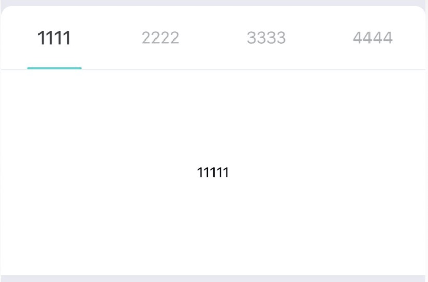

### 使用方法

```jsx
import {
    BorderRadiusTab
} from '../../../Viomi-plugin-sdk/Components/Tab';

  <BorderRadiusTab onChangeTab={(key) => this.onChangeTab(key)}>
        <View style={{ height: 200, backgroundColor: 'white', justifyContent: 'center', alignItems: 'center' }} tabLabel="1111" >
            <Text>11111</Text>
        </View>
        <View style={{ height: 200, backgroundColor: 'white', justifyContent: 'center', alignItems: 'center' }} tabLabel="2222" >
            <Text>22222</Text>
        </View>
        <View style={{ height: 200, backgroundColor: 'white', justifyContent: 'center', alignItems: 'center' }} tabLabel="3333" >
            <Text>33333</Text>
        </View>
        <View style={{ height: 200, backgroundColor: 'white', justifyContent: 'center', alignItems: 'center' }} tabLabel="4444" >
            <Text>444444</Text>
        </View>
    </BorderRadiusTab>
```

#### Tab props

| 属性        | 默认参数 | 参数类型 | 是否必选 | 说明                  |
|-------------|----------|----------|----------|-----------------------|
| onChangeTab | ()=>{}   | function | true     | 点击tab选项卡回调函数 |
| tabLabel    | null     | string   | false    | tab子标题             |

[⬆️回到目录](#目录)

***    
## 文本输入框-TextInput

> 解决TextInput在Android上的问题

> 所有属性与TextInput一致

## 消息提示框-Toast

#### 引入

``` js
import Toast from "../Viomi-plugin-sdk/Components/Toast";
```

#### 使用

``` js
  < Toast
  displayTime = {
      2000
  }
  />
```

 #### 方法
 

``` js
 Toast.show("文本", icon资源);
```

 #### props 

| 属性        | 默认参数 | 参数类型 | 是否必选 | 说明           |
|-------------|----------|----------|----------|----------------|
| displayTime | 2000     | number   | false    | 显示的停留时间 |

[⬆️回到目录](#目录)

***    


